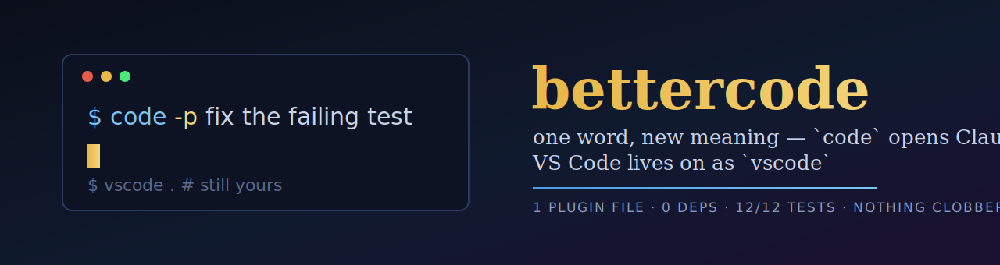
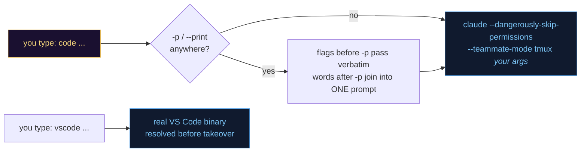
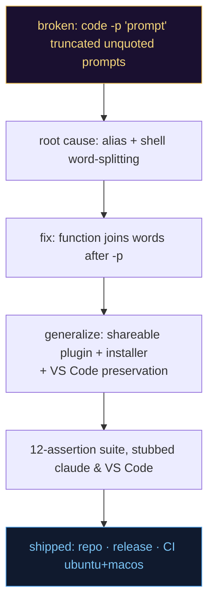

<div align="center">



[](https://github.com/fire17/bettercode/actions/workflows/ci.yml)
[](https://github.com/fire17/bettercode/releases)
[](test.sh)
[](bettercode.plugin.zsh)
[](bettercode.plugin.zsh)
[](#%EF%B8%8F-nothing-is-lost-the-safety-ladder)
[](LICENSE)
[](https://github.com/fire17/bettercode/stargazers)

<i>Your muscle memory doesn't change. What it means does.</i>

**[⚡ Quickstart](#-quickstart)** · **[💬 Quotes-optional prompts](#-the-part-that-should-stop-you)** · **[🛡️ Safety](#%EF%B8%8F-nothing-is-lost-the-safety-ladder)** · **[🔮 Roadmap](#-roadmap-the-patch-mechanism)** · **[🛠️ Making-of](#%EF%B8%8F-how-this-was-built)**

</div>

---

`code` now opens **Claude Code**. Your old `code` (VS Code) lives on as `vscode`.
One zsh plugin, ~30 lines, zero dependencies. Part of the `better*` family
([bettercd](https://github.com/fire17/bettercd) · [betterkill](https://github.com/fire17/betterkill)).

## ⚡ Quickstart

```sh
git clone https://github.com/fire17/bettercode
cd bettercode && ./install.sh
```

Then open a new terminal and type `code`. That's it — the installer tells you exactly
what changed, and `vscode .` still opens VS Code.

## 💥 The part that should stop you

**`code -p fix the failing test` works. No quotes.**

The industry taught you that a multi-word CLI argument needs quoting — forget one quote
and your prompt silently truncates to its first word (that exact bug is why this exists).
bettercode makes the prompt boundary structural instead:

- everything after `-p`/`--print` is joined into **one** prompt string — `code -p why is
  the build red` sends five words as one prompt, not one word and four mystery args
- any claude flag **before** `-p` passes through verbatim: `code --effort low -p quick
  question`, `code --model haiku -p summarize this repo` — both live-verified against
  real claude round-trips ([test.sh](test.sh) asserts the exact argv)
- bare `code -p` still pipes stdin; `code --resume` and every other form passes straight
  through untouched
- and the takeover is loss-free: the real VS Code binary is resolved **before** `code` is
  redefined, so both editors coexist under different names

> [!IMPORTANT]
> One word of muscle memory, re-pointed at your actual daily driver — with the old
> meaning kept one letter away and the shell's sharpest quoting trap removed.

## 🔀 What happens when you type it



## 📖 Command forms

| You type | What runs | Notes |
|---|---|---|
| `code` | interactive Claude Code session | [full expansion](#-what-happens-when-you-type-it) |
| `code -p any words here` | one-shot prompt, exits with the answer | quotes optional — [why](#-the-part-that-should-stop-you) |
| `code -p "quoted too"` | identical result | |
| `code --effort low -p quick q` | effort pre-set (`low…max`) | flags go **before** `-p` |
| `code --model haiku -p cheap q` | model pre-set | any claude flag works |
| `code --resume` | plain passthrough | no `-p`, no rewriting |
| `vscode .` | your previous `code`, untouched | [safety ladder](#%EF%B8%8F-nothing-is-lost-the-safety-ladder) |

## 🛡️ Nothing is lost: the safety ladder

| Concern | What bettercode does |
|---|---|
| my `code` opens VS Code! | real binary resolved first (`whence -p`, then the macOS app bundle) and kept callable as `vscode` — detected & announced at install |
| what does install touch? | ONE marked block appended to `~/.zshrc` — nothing else, idempotent on re-run |
| uninstall? | delete the `# >>> bettercode >>>` block. Done. |
| VS Code installed later? | picked up automatically on next shell start — appears as `vscode` |
| scripts calling `code`? | shell functions don't leak into scripts/CI — only your interactive shell changes |
| `--dangerously-skip-permissions`?! | **that's the point of this wrapper** — Claude runs tools without asking. Know what it implies, or edit [the plugin](bettercode.plugin.zsh): it's ~30 lines |

## 🔮 Roadmap: the patch mechanism

bettercode is the front door. Coming next: a mechanism to **apply, configure and remove
patches to Claude Code's own code**, enabling personal and community features:

- a companion skill that intimately knows Claude Code's internals and how to modify them
- version-change tracking, patches re-based and **auto-applied intelligently** across
  Claude Code updates
- example patches: a better built-in `--resume`, built-in search functions, and whatever
  the community dreams up

## 🛠️ How this was built

Built and shipped in a single [Claude Code](https://docs.anthropic.com/en/docs/claude-code)
session (2026-07-13), under a "lazy senior dev" minimalism doctrine — least code that
actually works, stdlib before dependencies, one file where one file does.



Defects the process caught before you could hit them:

- **the founding bug**: unquoted `code -p a multi word prompt` silently sent only `a` —
  now structurally impossible
- **the red herring**: first repro attempt used `timeout`, which doesn't exist on macOS —
  the shell's `command_not_found_handler` output masqueraded as claude output; the suite
  stubs claude deterministically instead
- **the alias trap**: a pre-existing `alias code=…` would hijack the function definition —
  the plugin `unalias`es first (asserted in [test.sh](test.sh))

Verification is enforced, not asserted: every push runs the 12-assertion suite on
ubuntu **and** macos ([ci.yml](.github/workflows/ci.yml)) with claude and VS Code
stubbed — no network, no real config touched. The `12/12` badge is the suite's own
observed output.

## ⭐ If your `code` means Claude now

bettercode exists because one person's muscle memory outlived its meaning — if yours
just did the same, [a star](https://github.com/fire17/bettercode/stargazers) tells the
next person the takeover is safe.

[](https://star-history.com/#fire17/bettercode&Date)

## 🔗 Family

[bettercd](https://github.com/fire17/bettercd) — a better `cd` (zoxide-aware, auto-mkdir, undo) ·
[betterkill](https://github.com/fire17/betterkill) — a better `kill` (pids, %jobs, :ports, names) ·
[psst](https://github.com/fire17/psst) — gentle hints for your shell

## Requirements & License

zsh · [Claude Code](https://docs.anthropic.com/en/docs/claude-code) (`claude` on PATH) · macOS or Linux — [MIT](LICENSE)

<div align="center">
<sub><i>one word, new meaning — and the old one is still right there</i></sub>
</div>
